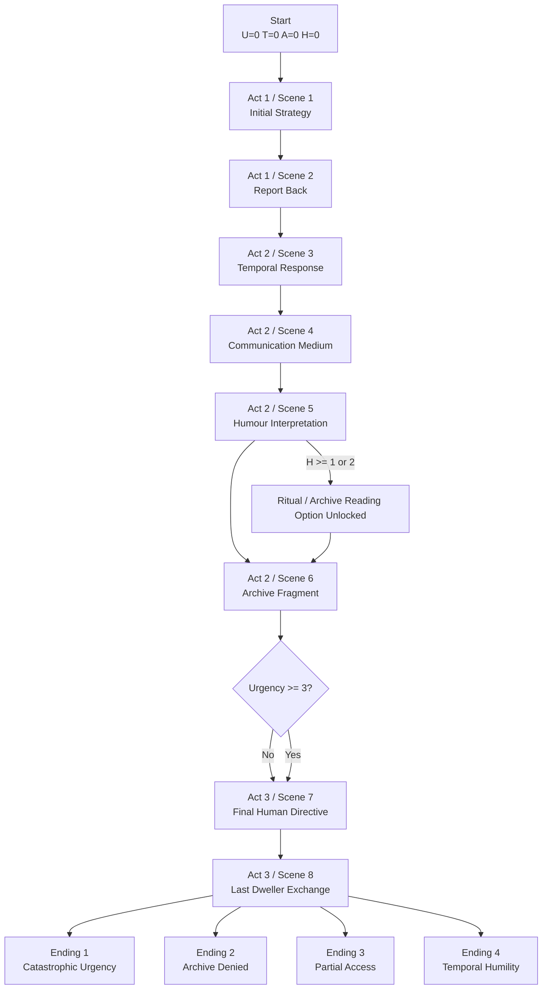

> Current playable build note: the live prototype now uses only two endings, **Good Ending** and **Bad Ending**. Older partial-ending references below are archival design notes.

# Branching Map

This file turns the design document into a branching overview that can be used for implementation, Trello tasking, or group planning.

## Global State Logic

- Start state: `urgency = 0`, `trust = 0`, `archiveAccess = 0`, `humourComprehension = 0`
- Act Three trigger: `urgency >= 3`
- Advanced humour interpretation option in Scene 5: recommend `humourComprehension >= 1` for prototype, `>= 2` for final build

## Mermaid Flowchart

## Ending Threshold Map

| Ending | Conditions | Interpretation |
| --- | --- | --- |
| Catastrophic Urgency | `urgency >= 5` or forced extraction route with very low trust | Human speed politics dominates |
| Archive Denied | `trust <= -2` | The Dwellers withdraw communicative access |
| Partial Access | `trust >= 1` and `archiveAccess >= 3` | Some understanding is gained, but not transformed into humility |
| Temporal Humility | `trust >= 3`, `archiveAccess >= 5`, `urgency <= 2`, `humourComprehension >= 2` | Best ending; player learns to inhabit Dweller epistemology |

## State Tension Summary

- Pursuing human efficiency usually raises `urgency` and lowers `trust`.
- Waiting, archiving, and interpretive listening usually raise `trust` and `archiveAccess`, but may let `urgency` accumulate.
- `humourComprehension` should not directly behave like a visible score; it works best as an option gate and response modifier.

## Suggested Build Flags

Recommended hidden flags for implementation after the first playable:

- `supportedExtraction` - marks whether the player backed direct force
- `protectedNegotiation` - marks whether the player repeatedly chose delay / preservation
- `misreadHumour` - tracks repeated anthropocentric misinterpretation
- `archivedInsteadOfAnswered` - tracks whether the player chose preservation over immediate decoding

These flags can improve line variation in Scene 8 and the ending text without requiring a huge branching explosion.

